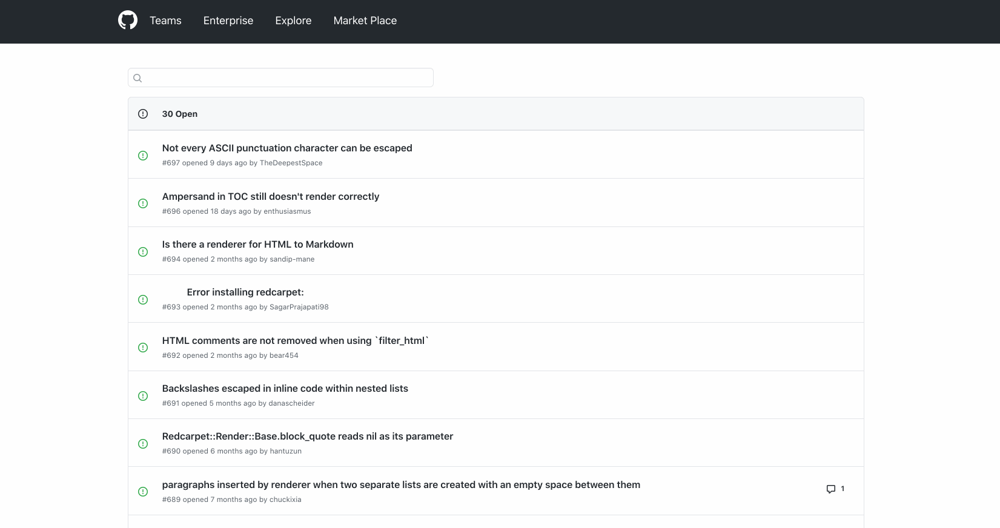

# Assignment 1  : Simplified version of Github Issues Page.

This project is build on React library.
Following are the some of the functionality , that i have implemented.

## Available functionality

### 1. Fetched API's from github (https://api.github.com/repos/vmg/redcarpet/issues?state=all).
### 2. Display list of  Issues on the page.
### 3. We can check issue by hovering on the Title.
### 4. By clicking on any Issue , you can navigate to detail issue page.
### 5. You can Detailed comments on Detail Page.
### 6. Integrated Custome Loader functionality.

For running this Repository you can run:

### 1. `npm i`
### 2. `yarn start`

## Require Environment for this project :

###  `node v12.0.0`

### You can see live Demo here :

